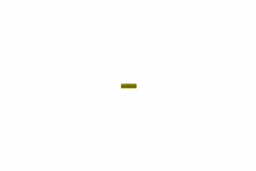
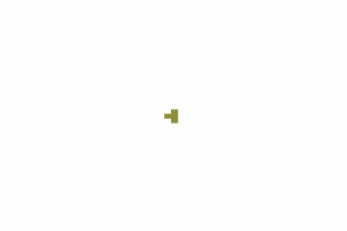

# 3D Conway's Game Of Life

Simulations using the 2333 rules in 3D and 2D

This project is a simulation of the Conway's game of life in a 3D environment. In fact, the game of life can be simulated in any given numbe of dimensions, but can only be visualized in 2D and 3D.

In the main you can define some parameters :
- `dim` gives the number of dimension of the environment
- `size` is the size of each dimension, if set to 10 the environment will be 10\*10\*10
- `random_start` is a number between 0 and 1 giving the chance of each cell to be alive at time 0
- `max_steps` The game will stop when all cells are dead or when a given number of steps have been computed
- `angle_between_steps` if you want the gif to turn and the pov to change between each steps you can precise the angle between two steps. If you don't want it to turn, just put the value to 0
-`frames_by_step` if the gif is turning you can choose to take several pictures by step in order to make the gif more fluid
- `output_path` is the direction you want to send the pictures
- `colorz` is the function that allows to choose the colors of the cells, depending on how long they are alive. By default, a new cell will be yellow, then turn to orange, dark orange and red.
- `rules` are used to decide when cells should live or die. `wxyzRules` are a special kind of rules that takes 4 parameters w,x,y and z  in which an alive cell will stay alive in the next generation if it has n live neighbors and w ≤ n ≤ x and a dead cell will become alive in the next generation if y ≤ n ≤ z

The custom_start.py file shows how you can initialize the grid with the wanted cells, using the addCell() function of the Grid class.

Once all the pngs are into a directory, they can be trasformed into a gif using the pngs2gif.py file.